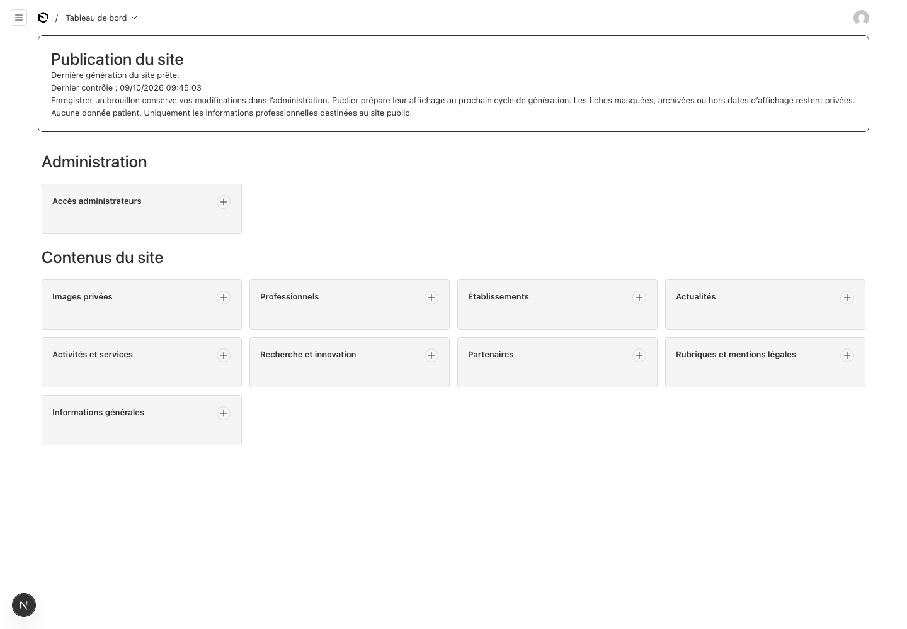
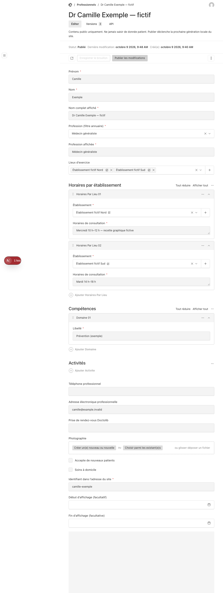

# Administrer le site Sant’Innovation

Guide pour le médecin responsable et la coordination — candidat local du 9 octobre 2026. **Aucune mise en production n’a été effectuée.** Les essais utilisent uniquement des contenus fictifs. Une publication dans cette installation prépare une version locale à contrôler ; elle ne publie rien sur Internet.

L’administration s’ouvre à [http://127.0.0.1:3001/admin](http://127.0.0.1:3001/admin), quand le responsable technique a démarré les services. Il vous remet un compte personnel par un canal sûr. Aucune connaissance de Git, de Markdown ou du code n’est nécessaire pour l’édition quotidienne.

**Ne saisir aucune donnée patient**, même dans un brouillon ou une image : pas de dossier, ordonnance, résultat, photographie de soin identifiable ou demande médicale. Cette interface gère les informations publiques de la MSP. Les anciennes sources de démonstration `/pro` sont conservées hors du site public ; aucune GED n’est fournie.

## Publier une actualité

1. Ouvrir **Actualités**, puis créer une fiche. Renseigner **Titre**, **Résumé**, **Catégorie** et **Date de publication affichée**. Écrire le texte dans **Présentation / contenu**, avec les outils de mise en forme.
2. Choisir un **Identifiant dans l’adresse du site**, par exemple `atelier-prevention-fictif`. Utiliser des minuscules, chiffres et tirets, sans espace ni accent. Après publication, conserver cet identifiant pour éviter de casser les liens déjà diffusés.
3. Dans **Image**, choisir une image existante ou en ajouter une. Formats acceptés : JPEG, PNG ou WebP ; taille maximale : 5 Mo. Renseigner **Description pour les personnes malvoyantes** et **Crédit / droits de diffusion**. Vérifier les droits et l’accord des personnes photographiées avant toute diffusion.
4. Cliquer **Enregistrer le brouillon**, puis **Aperçu privé**. L’aperçu est privé et affiche le dernier enregistrement ; il ne montre pas les changements encore non enregistrés. Il permet de relire le contenu, mais ne reproduit pas toute la mise en page du site public. Il n’y a pas d’enregistrement automatique.
5. Après validation éditoriale, vérifier **Visible sur le site**, laisser **Archiver (masquer et conserver)** décoché et cliquer **Publier** ou **Publier les modifications**. Une date d’affichage future peut encore empêcher l’apparition immédiate.
6. Revenir au tableau de bord, rubrique **Publication du site**, puis contrôler la page sur [le site local](http://127.0.0.1:4321). Le service vérifie les changements toutes les 60 secondes ; ajouter le temps de construction du site. Si le service est arrêté ou en erreur, la version précédente reste visible.

Le message **Dernière génération du site prête.** indique qu’une génération a abouti. Vérifier également la fraîcheur du **Dernier contrôle** et le résultat public. **La dernière génération a échoué…** ou **Aucune génération du site confirmée…** appelle une intervention du responsable technique. Une fiche marquée « Publié » dans le CMS n’est pas, à elle seule, une preuve de mise à jour du site.

Pour une correction, ouvrir la fiche, modifier, enregistrer le brouillon, relire l’aperçu puis publier les modifications. Tant que le brouillon n’est pas publié, le site conserve la dernière version publiée.

## Dates d’un événement et période d’affichage

| Champ | Utilité |
| --- | --- |
| **Date de publication affichée** | Date présentée avec l’actualité ; elle ne programme pas sa mise en ligne. |
| **Début de l’événement** / **Fin de l’événement** | Dates du rendez-vous annoncé. Elles ne masquent pas automatiquement l’article. |
| **Début d’affichage (facultatif)** / **Fin d’affichage (facultative)** | Période pendant laquelle un contenu déjà publié peut apparaître sur le site. Sans limite, laisser le champ vide. |

Utiliser l’heure de Paris. Le CMS est configuré pour **France (Paris)** et les valeurs sont conservées en UTC. Vérifier le fuseau indiqué et le résultat dans l’aperçu et sur le site lors de la recette, notamment près des changements d’heure ; ne pas décaler manuellement une heure saisie tant que l’affichage du formulaire n’est pas confirmé. La date de fin d’affichage doit être postérieure au début. Le retrait à échéance dépend du service de génération : une panne peut retarder le retrait.

## Ajouter un lieu, puis un professionnel

Dans **Établissements**, créer la fiche avec le nom, l’adresse, les coordonnées professionnelles et les **Horaires d’ouverture**. Compléter les informations d’accès connues et les photographies. Cocher **Accès adapté aux personnes à mobilité réduite** uniquement après vérification du cabinet concerné ; donner les précisions utiles dans **Précisions d’accessibilité**.

La publication d’un établissement exige **Latitude vérifiée**, **Longitude vérifiée** et **Adresse et position géographique vérifiées**. Faire confirmer la position avec le responsable technique si nécessaire. Après une modification d’adresse ou de position : enregistrer le brouillon, vérifier à nouveau, cocher la confirmation puis publier. Les itinéraires du site sont construits à partir de l’adresse ; contrôler leur destination après publication. Modifier seulement le champ **Lien d’itinéraire** ne remplace pas cette vérification.

Dans **Professionnels**, renseigner le nom, **Nom complet affiché**, **Profession (filtre annuaire)** et **Profession affichée**. Choisir tous les **Lieux d’exercice**, puis ajouter une ligne dans **Horaires par établissement** pour chaque lieu concerné : **Établissement** et **Horaires de consultation**. Chaque lieu d’un horaire doit aussi être sélectionné dans les lieux d’exercice. Publier les établissements avant les professionnels qui les utilisent.

Ajouter les coordonnées professionnelles, la **Photographie** et le lien **Prise de rendez-vous Doctolib**. Utiliser la fiche exacte en HTTPS, puis tester le bouton sur le site. Confirmer **Accepte de nouveaux patients** et **Soins à domicile** auprès du professionnel. Pour un changement de lieu, mettre à jour ensemble la sélection des lieux et les horaires correspondants. Enregistrer le brouillon, relire puis publier.

Avant de masquer un établissement, réaffecter les professionnels concernés. Une référence à un lieu absent de la version publique peut bloquer la génération ; le site précédent est alors conservé.

## Autres contenus et liens

| Menu | Contenu modifiable |
| --- | --- |
| **Activités et services** | Présentation des activités, images et liens utiles. |
| **Recherche et innovation** | Projets, état réel d’avancement, images et liens. |
| **Partenaires** | Nom, description, site internet et logo, après validation du partenariat et des droits. |
| **Rubriques et mentions légales** | Textes des rubriques proposées dans **Rubrique du site**. |
| **Informations générales** | Identité, contacts généraux et liens communs ; modification réservée à un administrateur. |

Les liens sont saisis avec `https://`. Les champs Doctolib n’acceptent que Doctolib. Vérifier la destination, le libellé et les informations de contact avant publication. Les informations encore incertaines sont recensées dans [Vérification des contenus](docs/VERIFICATION_CONTENUS.md).

Pour les mentions légales, la confidentialité et l’accessibilité, enregistrer d’abord le texte corrigé en brouillon. Un administrateur doit ensuite confirmer **Contenu réglementaire validé par un administrateur** et publier. La validation précédente est annulée après modification. Les **Informations générales** exigent également **Coordonnées confirmées par un administrateur** après une correction des contacts. Cocher ces cases atteste une validation humaine préalable ; le logiciel ne vérifie pas leur exactitude juridique ou factuelle.

## Retirer ou restaurer un contenu

Les trois rubriques réglementaires doivent rester publiées et validées. Leur dépublication ou archivage bloque la génération complète et conserve l’ancien site : faire valider une nouvelle version avant de la publier.

Pour retirer une fiche, utiliser **Annuler la publication** et confirmer. Le retrait du site intervient après une génération réussie. Pour conserver un contenu rangé comme archive, cocher **Archiver (masquer et conserver)** puis **Publier les modifications** : cet état exclut la fiche de la sortie publique. Décocher **Visible sur le site** puis publier permet également de la masquer. Un simple enregistrement en brouillon de ces cases laisse la version publique précédente en place.

Pour revenir à un ancien contenu : ouvrir **Versions**, comparer les versions, choisir celle souhaitée et **Restaurer comme brouillon**. Relire **Aperçu privé**, vérifier dates, lieux, images et liens, puis publier explicitement. Une adresse ou un texte réglementaire restauré peut nécessiter une nouvelle confirmation. Jusqu’à 50 versions sont conservées par fiche ; pour un contenu plus ancien ou une perte de base, solliciter le responsable technique et les sauvegardes.

Les images enregistrées sont **immuables**, y compris leur description et leur crédit. Pour remplacer une photo ou corriger sa description, créer une nouvelle image, la choisir dans un brouillon, puis publier la fiche. Une image non référencée par un contenu public reste privée dans le CMS. Ne pas tenter de remplacer un fichier sur le serveur.

## Comptes et assistance

Un **Éditeur** gère et publie les contenus courants. Un **Administrateur** gère aussi les comptes dans **Accès administrateurs**, les coordonnées générales et les validations réglementaires. Utiliser un compte nominatif ; ne pas partager le mot de passe. L’administrateur choisit le **Rôle**, **Éditeur** ou **Administrateur**, et communique l’accès de manière privée.

La réinitialisation du mot de passe par courriel n’est pas configurée : contacter un administrateur. Il n’y a pas de second facteur intégré livré dans cette version. Fermer la session sur un poste partagé. En cas d’erreur, communiquer le nom de la fiche et le message affiché, sans mot de passe ni donnée de santé.

Le site reste la source de référence des actualités. Après publication autorisée, son lien peut être relayé manuellement sur les réseaux sociaux ; aucune diffusion automatique multiréseaux n’est prévue.

Le [guide de maintenance](docs/MAINTENANCE.md) est destiné au responsable technique. Les résultats réellement vérifiés et leurs limites figurent dans `LIVRAISON_SITE_MSP.md` ; ce guide décrit la procédure et ne constitue pas un procès-verbal de recette.
